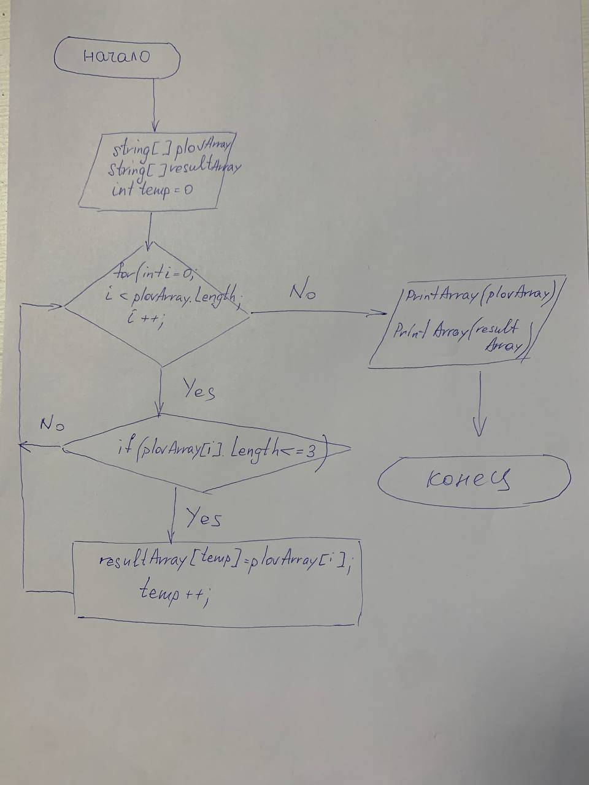

# ЗАДАЧА:
Написать программу, которая из имеющегося массива строк формирует массив из строк, длина которых меньше либо равна 3 символа. Первоначальный массив можно ввести с клавиатуры, либо задать на старте выполнения алгоритма. При решение не рекомендуется пользоваться коллекциями, лучше обойтись исключительно массивами

# Алгоритм решения задачи следующий:

# Описание решения задачи.

### 1. Объявление массивов типа **string**, заданного **plovArray** и искомого **resultArray**.
### 2. Объявление метода **MassivMassiv**, в котором в качестве аргументов выступают массивы **plovArray** и **resultArray**, а так же :
- задается цикл **for** для каждого значения заданного массива **plovArray**;
- задается переменная **temp** (индекс) для формирования искомого массива **resultArray**;
- задается условие **if** для сравнения значения заданного массива по условию задачи;

В случае выполнения условия **if**, значение из заданного массива по индексу **i** записывается в искомый по текущему индексу **temp**, после чего **temp** увеличивается на 1.

В случае не выполнения условия **if**, переходим к следующему значению заданного массива, значение **temp** остается без изменений.

### 3. Объявление метода **PrintArray** заполнение массива.

### 4. Вывод решения в консоль:
- заданный массив **plovArray**;
- искомый масcив **resultArray**.

 